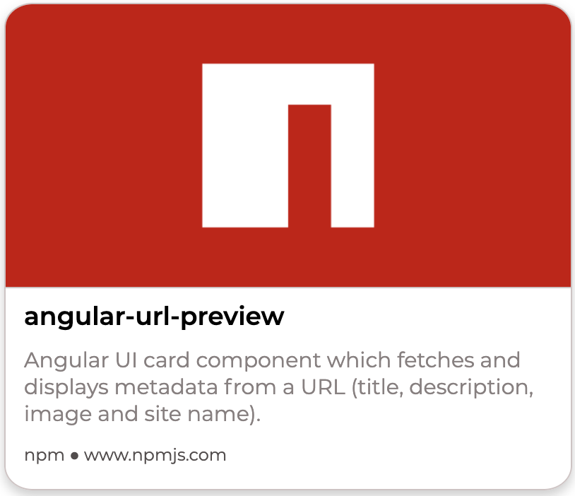

<div align="center"></div>

## Angular URL Preview

Angular UI card component which fetches and displays metadata from a URL (title, description, image and site name).

### Installation

`npm install angular-url-preview`

In app.module.ts:
```typescript
import { NgModule } from  '@angular/core';
import { BrowserModule } from  '@angular/platform-browser';
import { AppComponent } from  './app.component';
import { AngularUrlPreviewModule } from  'angular-url-preview';

@NgModule({
declarations: [AppComponent],
imports: [BrowserModule, AngularUrlPreviewModule],
bootstrap: [AppComponent]
})
export  class  AppModule { }
```

### Usage

In the component's template:

```html
<ngx-url-preview  url="example.com"></ngx-url-preview>
```

Specifying the URL is mandatory and it can be in any format, such as:
 - Apex domain: example.com
 - Subdomain: www.example.com
 - With protocol: https://example.com or https://www.example.com

